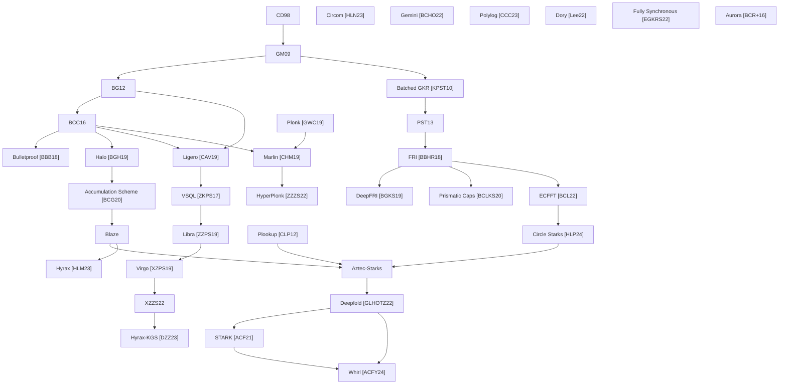

# pcs-mindmap

```mermaid
graph TB
    %% Nodes for each paper with links
    CD98["CD98"]
    GM09["GM09"]
    BG12["BG12"]
    BCC16["BCC16"]
    BBB18["Bulletproof [BBB18]"]
    BGH19["Halo [BGH19]"]
    HLM23["Hyrax [HLM23]"]
    CAV19["Ligero [CAV19]"]
    ZKPS17["VSQL [ZKPS17]"]
    ZZPS19["Libra [ZZPS19]"]
    XZPS19["Virgo [XZPS19]"]
    XZZS22["XZZS22"]
    DZZ23["Hyrax-KGS [DZZ23]"]
    BCL22["ECFFT [BCL22]"]
    HLP24["Circle Starks [HLP24]"]
    HLN23["Circom [HLN23]"]
    CLP12["Plookup [CLP12]"]
    BBHR18["FRI [BBHR18]"]
    BGKS19["DeepFRI [BGKS19]"]
    BCLKS20["Prismatic Caps [BCLKS20]"]
    BCHO22["Gemini [BCHO22]"]
    ACF21["STARK [ACF21]"]
    ACFY24["Whirl [ACFY24]"]
    GLHOTZ22["Deepfold [GLHOTZ22]"]
    KPST10["Batched GKR [KPST10]"]
    PST13["PST13"]
    CCC23["Polylog [CCC23]"]
    Lee22["Dory [Lee22]"]
    BCG20["Accumulation Scheme [BCG20]"]
    EGKRS22["Fully Synchronous [EGKRS22]"]
    Blaze["Blaze"]
    GWC19["Plonk [GWC19]"]
    CHM19["Marlin [CHM19]"]
    ZZZS22["HyperPlonk [ZZZS22]"]
    BCR16["Aurora [BCR+16]"]
    AztecStarks["Aztec-Starks"]

    %% Connections as per the image details
    CD98 --> GM09
    GM09 --> BG12
    BG12 --> BCC16
    BCC16 --> BBB18
    BCC16 --> BGH19
    BCC16 --> CAV19
    BGH19 --> BCG20
    BCG20 --> Blaze
    BG12 --> CAV19
    BCC16 --> CHM19
    CAV19 --> ZKPS17
    ZKPS17 --> ZZPS19
    ZZPS19 --> XZPS19
    XZPS19 --> XZZS22
    XZZS22 --> DZZ23
    BBHR18 --> BGKS19
    BBHR18 --> BCLKS20
    BCL22 --> HLP24
    HLP24 --> AztecStarks
    BBHR18 --> BCL22
    ACF21 --> ACFY24
    GWC19 --> CHM19
    Blaze --> AztecStarks
    GM09 --> KPST10
    KPST10 --> PST13
    PST13 --> BBHR18
    CHM19 --> ZZZS22
    CLP12 --> AztecStarks
    AztecStarks --> GLHOTZ22
    GLHOTZ22 --> ACF21
    GLHOTZ22 --> ACFY24
    Blaze --> HLM23

    %% Links to specific papers
    click CD98 "https://link.springer.com/article/10.1007/3-540-49649-1_18" _blank
    click GM09 "https://eprint.iacr.org/2008/459" _blank
    click BG12 "https://eprint.iacr.org/2011/535" _blank
    click BCC16 "https://eprint.iacr.org/2016/260" _blank
    click BBB18 "https://eprint.iacr.org/2017/031" _blank
    click BGH19 "https://eprint.iacr.org/2019/1021" _blank
    click HLM23 "https://arxiv.org/abs/2211.12888" _blank
    click CAV19 "https://eprint.iacr.org/2019/663" _blank
    click ZKPS17 "https://eprint.iacr.org/2017/032" _blank
    click ZZPS19 "https://eprint.iacr.org/2019/1110" _blank
    click XZPS19 "https://eprint.iacr.org/2019/1420" _blank
    click XZZS22 "https://eprint.iacr.org/2022/193" _blank
    click DZZ23 "https://eprint.iacr.org/2023/048" _blank
    click BCL22 "https://eprint.iacr.org/2022/587" _blank
    click HLP24 "https://eprint.iacr.org/2024/123" _blank
    click HLN23 "https://eprint.iacr.org/2023/745" _blank
    click CLP12 "https://eprint.iacr.org/2012/142" _blank
    click BBHR18 "https://eprint.iacr.org/2018/1038" _blank
    click BGKS19 "https://eprint.iacr.org/2019/774" _blank
    click BCLKS20 "https://eprint.iacr.org/2020/241" _blank
    click BCHO22 "https://eprint.iacr.org/2022/172" _blank
    click ACF21 "https://eprint.iacr.org/2021/582" _blank
    click ACFY24 "https://eprint.iacr.org/2024/456" _blank
    click GLHOTZ22 "https://eprint.iacr.org/2022/1559" _blank
    click KPST10 "https://eprint.iacr.org/2010/602" _blank
    click PST13 "https://eprint.iacr.org/2013/027" _blank
    click CCC23 "https://eprint.iacr.org/2023/789" _blank
    click Lee22 "https://eprint.iacr.org/2022/948" _blank
    click BCG20 "https://eprint.iacr.org/2020/499" _blank
    click EGKRS22 "https://eprint.iacr.org/2022/1345" _blank
    click Blaze "https://eprint.iacr.org/2024/700" _blank
    click GWC19 "https://eprint.iacr.org/2019/953" _blank
    click CHM19 "https://eprint.iacr.org/2019/1047" _blank
    click ZZZS22 "https://eprint.iacr.org/2022/1183" _blank
    click BCR16 "https://eprint.iacr.org/2016/098" _blank
    click AztecStarks "https://eprint.iacr.org/2024/245" _blank
```
